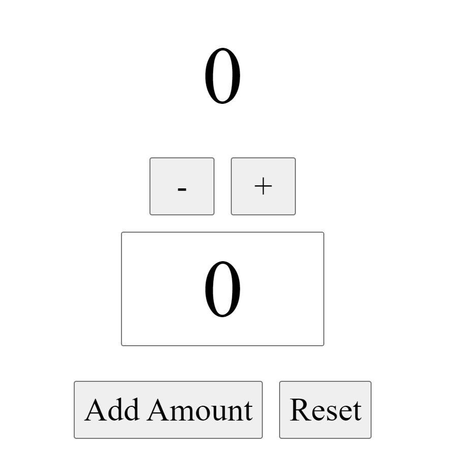

# React-Redux Counter App
This is a simple Counter application built using React-Redux and Redux Toolkit. It includes a `store` with a `counterSlice` defining actions and a reducer, a Counter component for displaying and interacting with the counter value, and an App component as the parent component.

## Features
- Increment the counter by 1.
- Decrement the counter by 1.
- Increment the counter by a specific amount.
- Reset the counter value and the increment amount state.

## Usage
- Use the `+` button to increment the counter by 1.
- Use the `-` button to decrement the counter by 1.
- Specify the amount you want to add in the input field.
- Use the `Add Amount` button to increment the counter by a specific amount.
- Use the `Reset` button to reset the counter value and the increment amount state.

## Screenshot of the React-Redux Counter App

## Project Structure
- `src/app/store.jsx:` Contains the Redux store configuration.
- `src/features/counter/counterSlice.jsx:` Defines actions and the reducer for the counter.
- `src/features/counter/Counter.jsx:` Renders the Counter, and handles dispatching increment, decrement, increment by amount and reset actions.
- `src/App.jsx:` Parent component rendering the Counter component.
- `src/main.jsx:` Root component where the Redux store is provided to the React app.

## Contributing
Contributions to this project are welcome! You can contribute by opening issues or submitting pull requests for improvements or bug fixes.