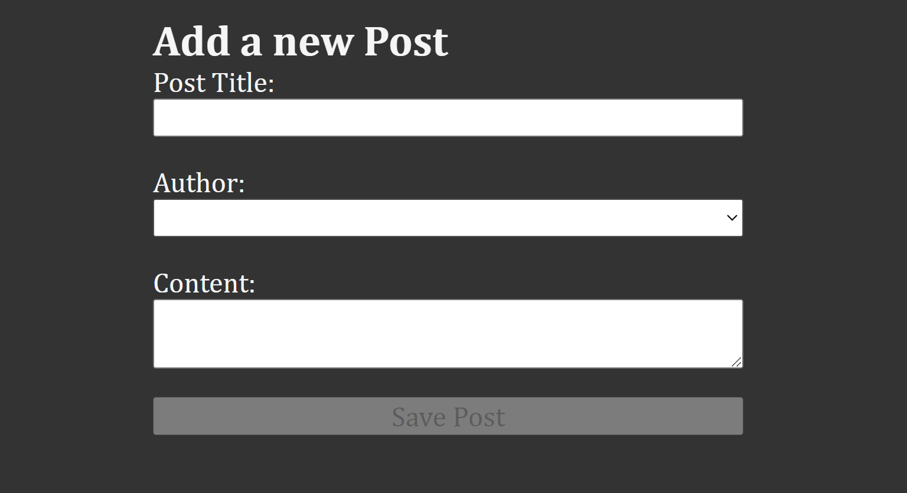
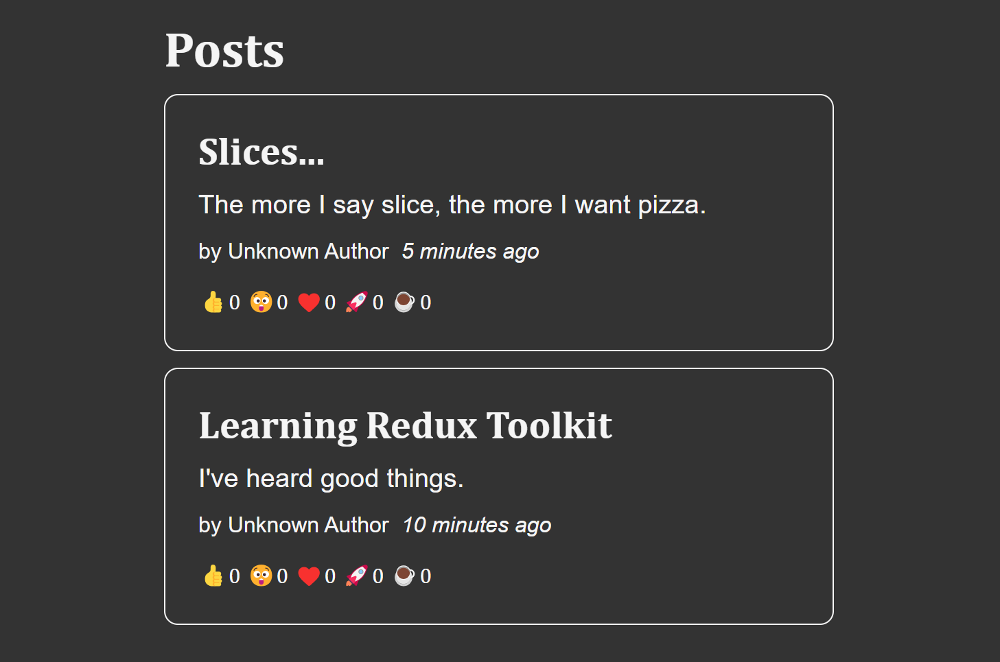

# React-Redux Post App

This is a Post App built using React-Redux and Redux Toolkit. It allows users to add and save posts, view posts, with titles, content, authors(select options) and display post with additional details such as the time the post was created and reaction emojis.

## Features
- Add and save posts with titles, content and authors.
- View posts with detailed information:
  - Post title.
  - Post content.
  - Author (select options).
  - Time ago since post added.
  - Reaction emojis with the ability to add to the reaction count by clicking.

## Usage
- Use the `Save Post` button to create a new post with title, content, and author selection.
- The `Save Post` button remains disabled until all required fields are filled in.
- View the list of posts with details including title, content, author, time ago, and reaction emojis.
- Click on the reaction emojis to add to the reaction count for each post.

## Screenshot of the React-Redux Post App
### Adding a Post Form

### Display of posts

## Project Structure
- `src/app/store.jsx:` Contains the Redux store configuration.
- `src/features/posts/postsSlice.jsx:` Defines actions and the reducer for managing posts.
- `src/features/posts/AddPostForm.jsx:` Form component for adding new posts.
- `src/features/posts/PostList.jsx:` Component for displaying a list of posts with details and reaction emojis.
- `src/features/posts/PostAuthor.jsx:` Component for displaying the post author.
- `src/features/posts/ReactionButtons.jsx:` Component for displaying reaction emojis and handling reaction counts.
- `src/features/posts/TimeAgo.jsx:` Component for displaying the time ago since post creation.
- `src/features/users/usersSlice.jsx`: Defines actions and the reducer for managing users.

## Contributing 
Contributions to this project are welcome! You can contribute by opening issues or submitting a pull request for improvements or bug fixes.
